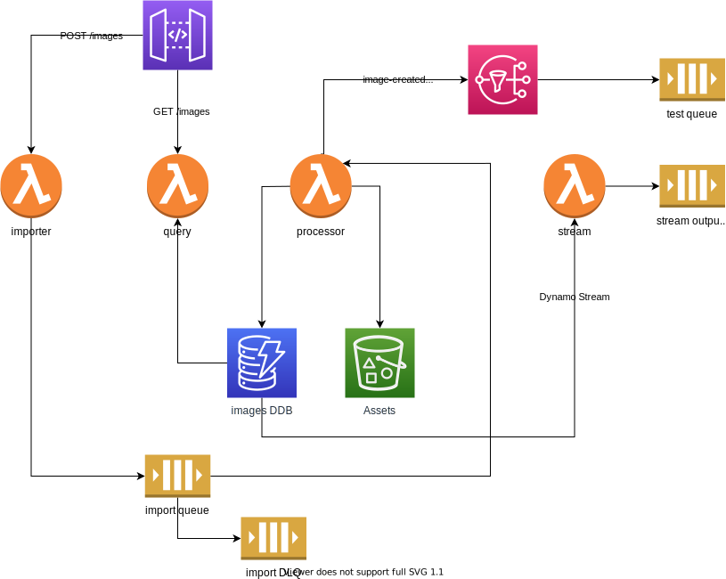

# localstack with serverless demo

This is somewhat of a contrived application that demonstrates how [localstack](https://localstack.cloud/) can be used in conjunction with [serverless](https://www.serverless.com/) and [cloudformation](https://aws.amazon.com/cloudformation/) for local development of AWS components:

- [Lambda](https://aws.amazon.com/lambda/)
- [S3](https://aws.amazon.com/s3/)
- [DynamoDB](https://aws.amazon.com/dynamodb/)
- [SNS](https://aws.amazon.com/sns/)
- [SQS](https://aws.amazon.com/sqs/)

## Environment setup

```bash
yarn local:up
```



```bash
# tear down localstack docker container
yarn local:down
```

## Testing

```bash
yarn dev

yarn test
```

[query API](http://localhost:21001/images)

```bash
# clear S3, SQS and Dynamo
yarn purge
```

## Localstack command samples

### SNS

```bash
awslocal sns list-topics

awslocal sns publish --topic-arn "arn:aws:sns:us-east-1:000000000000:image-created" --message 'test image created message'

awslocal sns publish --topic-arn "arn:aws:sns:us-east-1:000000000000:image-updated" --message 'test image updated message'
```

### SQS

```bash
awslocal sqs list-queues

awslocal sqs send-message --message-body="{}" --queue-url "http://localhost:4566/queue/test"

awslocal sqs receive-message --queue-url "http://localhost:4566/queue/test" --max-number-of-messages 10

awslocal sqs delete-message --queue-url "http://localhost:4566/queue/test" --receipt-handle <handle>

awslocal sqs send-message --message-body="test-dlq" --queue-url "http://localhost:4566/queue/imports"

awslocal sqs receive-message --queue-url "http://localhost:4566/queue/imports-dlq" --max-number-of-messages 10
```

### S3

```bash
awslocal s3api list-buckets

awslocal s3 cp test/test-dynamo-record.json s3://images

awslocal s3api list-objects --bucket images
```

Bucket content is [available here](http://localhost:4566/images/), using the image hash as the slug to get a specific image, e.g.

- [Tower bridge](http://localhost:4566/images/11386987)
- [Millennium bridge](http://localhost:4566/images/4173522365)

### Dynamo DB

```bash
awslocal dynamodb list-tables

awslocal dynamodb put-item \
 --table-name images \
 --item file://test/test-dynamo-record.json \
 --return-consumed-capacity TOTAL \
 --return-item-collection-metrics SIZE

awslocal dynamodb scan --table-name images

awslocal dynamodbstreams list-streams
```
